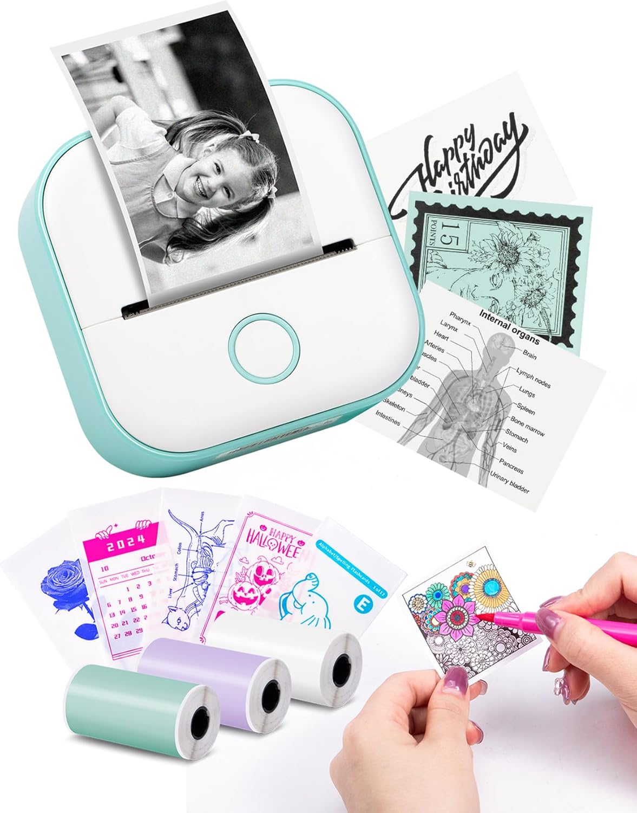

# Phomemo Printers

This repository lets you control a Phomemo T02 "Cat printer" using Swift on MacOS. It could probably be used on iOS as well and primarily offers the basic pieces to work with CoreBluetooth and CGImage.



You can get one of these printers [here](https://www.amazon.com/dp/B0BD5BX4HW).

## Inspiration

This repository is largely inspired by https://github.com/vivier/phomemo-tools.

But you can also checkout:

* https://github.com/abhigkar/YHK-Cat-Thermal-Printer
* https://github.com/TheNitek/CatGFX
* https://gist.github.com/xssfox/b911e0781a763d258d21262c5fdd2dec
* https://github.com/bitbank2/Thermal_Printer
* https://brainbaking.com/post/2023/02/phomemo-thermal-printing-on-macos/ (and https://git.brainbaking.com/wgroeneveld/phomemo-printer)

## Tools

This repository offers a couple of tools:

**Scanner**

This allows you to discover what kind of printer you have and if Bluetooth is powered on. Make sure you're using the scanner in `main.swift`, then run. If everything works you should see something like:

```
Bluetooth powered on — starting scan
Discovered: T02 (AD75636C-8E43-E09C-746D-2333B7051330) RSSI: -56
  └── AF30 (UUID: 0000AF30-0000-1000-8000-00805F9B34FB
  └── Human Interface Device (UUID: 00001812-0000-1000-8000-00805F9B34FB
```

**Phomemo**

The primary tool is the `PhomemoWriter`. it allows you to discover and connect to a T02 phomemo printer. You can receive notifications from the printer (including cover and paper status) and send images to the printer. The repository also includes utilities for converting images to monochrome and dithered monochrome.

Before running, connect to the printer once in your System Settings (see `encryption` below).

Make sure you're using the PhomemoWriter in `main.swift`, the run. If everything works you should see something like:

```
Scanning for peripherals…
Found T02 — connecting…
Connected! Discovering services…
Did discover service [<CBService: 0x600003520000, isPrimary = YES, UUID = FF00>]
Did discover charateristics
Char FF01 properties: 2
  → supports read
Char FF02 properties: 12
Char FF03 properties: 16
  → supports notify
✅ Finished writing file.
Notifications enabled for FF03
Notification from FF03
-- : [1, 1]
🖨️ Ready
Notification from FF03
-- : [2, 182, 0]
Notification from FF03
-- : [1, 1]
Notification from FF03
-- : [1, 1]
Notification from FF03
-- : [1, 1]
Notification from FF03
-- : [1, 1]
Notification from FF03
-- : [26, 6, 137]
📃 Have paper
Notification from FF03
-- : [26, 5, 152]
🚪 Printer cover is closed
Notification from FF03
-- : [1, 1]
Notification from FF03
-- : [1, 1]

... many more [1, 1] notifications ...

Notification from FF03
-- : [1, 1]
Notification from FF03
-- : [26, 4, 83]
Notification from FF03
-- : [26, 9, 12]
Notification from FF03
-- : [26, 7, 3, 0, 7]
Notification from FF03
-- : [26, 8, 81, 49, 49, 52, 69, 52, 56, 84, 50, 53, 56, 48, 57, 49, 53]
Notification from FF03
-- : [26, 15, 12]
✅ Print complete
```

And the printer should print a photo.

## Troubleshooting

### Nothing detected

The code in this repository is locked to the `T02` listed above. Maybe you have another (compatible?) printer. Double check and change the code (name and service ids). The `Scanner` should help.

It is also possible the printer is just not in the right state - hold the printer button for 20 seconds until it blinks. This hard-resets the printer. Then hold the button for three seconds to put it in connect mode.

You might also be connected to the printer from the [Phomemo App](https://apps.apple.com/us/app/phomemo/id1456102145) (or another tool). The printer can only be connected to one device at a time. Close the other apps and try again.

### Encryption

If you don't see any notifications (please wait up to 30 seconds). You may instead see:

```
Notify failed: Encryption is insufficient.
➡️  Try pairing the printer in Bluetooth settings first.
```

This device connects over BLE and the connection is sufficient to _write_ to the write characteristic. But it is not sufficient to receive notifications. In order to receive notifications it requires an encrypted channel. The only way to get this is to pair with the device in your System Settings, Bluetooth pane one time. After you have paired with it once you'll be able to receive notifications.

Open Settings, Bluetooth and connect to the T02. You may need to connect to Bluetooth Device and *not* the Printer. Connecting to the Bluetooth Device always worked for me, but connecting to the printer sometimes did not work. In either case, once connected it will look like a printer icon, but click the (i) and look at the Device Type to verify.

If you "Forget this device" you will need to restart bluetoothd:

```
sudo pkill bluetoothd
```

And then reconnect to establish the encrypted channel again.

Note: if you don't care about the notifications you can skip this step and happily write to the device with no notifications, but it will be difficult to debug if something goes wrong.

### Cover open or out of paper won't go away

These states tend to get stuck on the printer. You may need to hard reset it.

### USB

The USB is power-only. Don't try to connect the printer via USB. That doesn't work.
